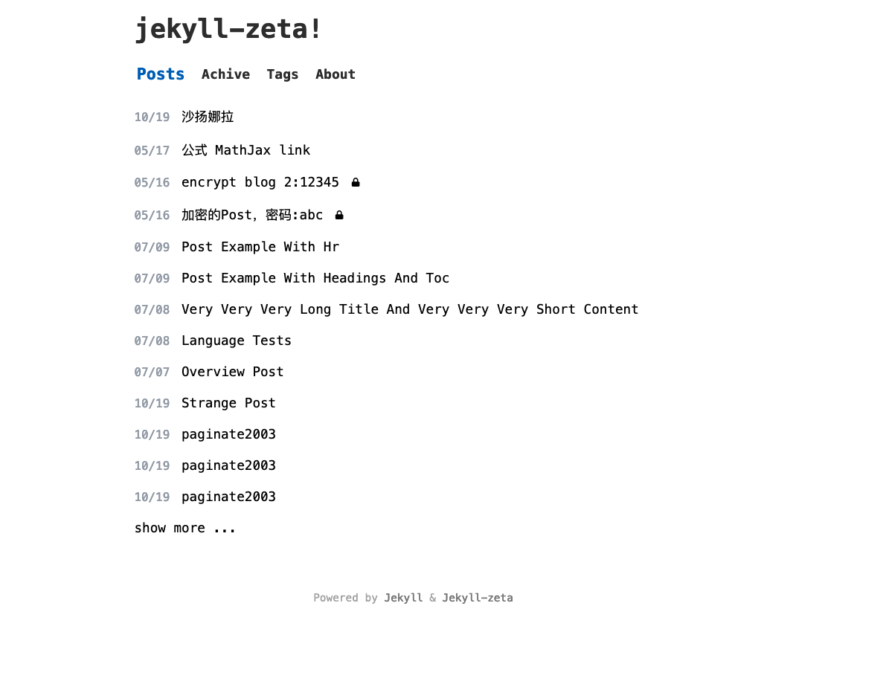

# jekyll-zeta

[demo page](https://jekyll-zeta.pages.dev/)

 
## Features

- **Pagination support** - Built-in pagination for blog posts
- **Tags support** - Organize and categorize your posts with tags
- **MathJax support** - Render mathematical expressions with MathJax
- **Code inclusion support** - Include code snippets in your posts
- **Post linking** - Link to other posts within your blog
- **Encryption support** - Protect sensitive content with password-based encryption. Only users with the correct password can view encrypted articles

### Encryption Feature

**Important Note**: 
- ~~Only textual content of articles will be encrypted; images will **NOT** be encrypted~~
- **Images can be encrypted** using the `asset_img` tag (available from `v0.11.6`)

To encrypt images:
1. Name your sensitive images with the `.sec` extension (e.g., `name.sec.png`)
2. Add the following exclude configuration to your `_config.yml`:

```yaml
exclude:
  - "**/*.sec.*"
  - "*.sec.*"
```

#### How to Encrypt Your Posts

1. **Generate your public and private keys** to protect your password:

```bash
ltectool g
```

You will receive output similar to:

```
publickey: AAA
privatekey: BBBBB
```

2. **Encrypt your password** using the public key:

```bash
# ltectool e [your publickey] [your password]
# Example:
ltectool e Arkuf0hG0sjifj+G57o4gwPgnXXD72kIhjhSGjyyGCdS 123

# Output:
AQAQACAAIQCVKE9YHFT4pzyMa84kqGK+4Olo3EeDlymDa0oZcsQ48j8S4D4fMFb37gUT4LgrxZQDCFLa402i9VhhMIYWXZP+WSsv2Ia+uQpEH5vYKgDR5vL4xXC/76wXl3K7abU7u9du
```

3. **Add the encrypted password** to your `_config.yml`:

```yaml
enc_tags:
  - tag: encrypt1
    password: "123"  # Plain text - NOT recommended

  - tag: encrypt2
    # 123
    password: AQAQACAAIQCVKE9YHFT4pzyMa84kqGK+4Olo3EeDlymDa0oZcsQ48j8S4D4fMFb37gUT4LgrxZQDCFLa402i9VhhMIYWXZP+WSsv2Ia+uQpEH5vYKgDR5vL4xXC/76wXl3K7abU7u9du
```

4. **Set the private key** as an environment variable before running `jekyll build`, or configure it in your CI environment:

```bash
# export JEKYLL_EC_PRIVATEKEY=[Private key]
export JEKYLL_EC_PRIVATEKEY="NWWtiQbDnSDvTdogCzAjqNqHGTZrRXdmXQrEKiv3vNs="
```

**Security Recommendation**: For enhanced security, use separate repositories to store your source files and the `_site` files.   

### Origin

This theme is based on a minimal, performance-focused design with the following characteristics:

- **Fast** - **1KB of CSS!** For more information on performance, see the [Page Speed Insights report](https://raw.githubusercontent.com/riggraz/no-style-please/master/_screenshots/page-speed-insights-report.png) and [Lighthouse report](https://raw.githubusercontent.com/riggraz/no-style-please/master/_screenshots/lighthouse-report.png)
- **Light, dark, and auto modes** - Automatic theme switching based on system preferences
- **Responsive** - Optimized for all device sizes
- **Content-first** - Typography optimized for maximum readability
- ~~SEO optimized (uses [Jekyll SEO Tag](https://github.com/jekyll/jekyll-seo-tag))~~
- ~~RSS feed (uses [Jekyll Feed](https://github.com/jekyll/jekyll-feed))~~
- ~~Fully compatible with [GitHub Pages](https://pages.github.com/) (see [GitHub Pages installation](#github-pages-installation))~~

> **Note**: You should build the `_site` directory yourself, as GitHub Pages does not support all Jekyll plugins.


## Installation

If you haven't already created your blog using Jekyll, follow the [instructions](https://jekyllrb.com/docs/) to do so from Jekyll's documentation.

**Note**: If you are using Jekyll with GitHub Pages, see the [GitHub Pages installation section](#github-pages-installation).

Then, to style your blog with this theme, add this line to your Jekyll site's `Gemfile`:

```ruby
gem "jekyll-zeta"
```

And add this line to your Jekyll site's `_config.yml`:

```yaml
theme: jekyll-zeta
```

And then execute:

    $ bundle

Or install it yourself as:

    $ gem install jekyll-zeta
 
### Customize the Menu

Edit the `theme_config > menu` section in `_config.yml`.

Below is the default configuration:

```yaml
theme_config:
  menu:
    - title: Home
      url: /
    - title: Archive
      url: /archive.html
    - title: Tags
      url: /tags.html
    - title: About
      url: /about.html
```


### Show All Tags

1. Create a `tags.md` file with the following content:

```yaml
---
title: TAGS
layout: tags
permalink: /tags/index.html
---
```

2. Add an entry to `_data/menu.yml`:

```yaml
- title: tags
  url: tags
```

 
